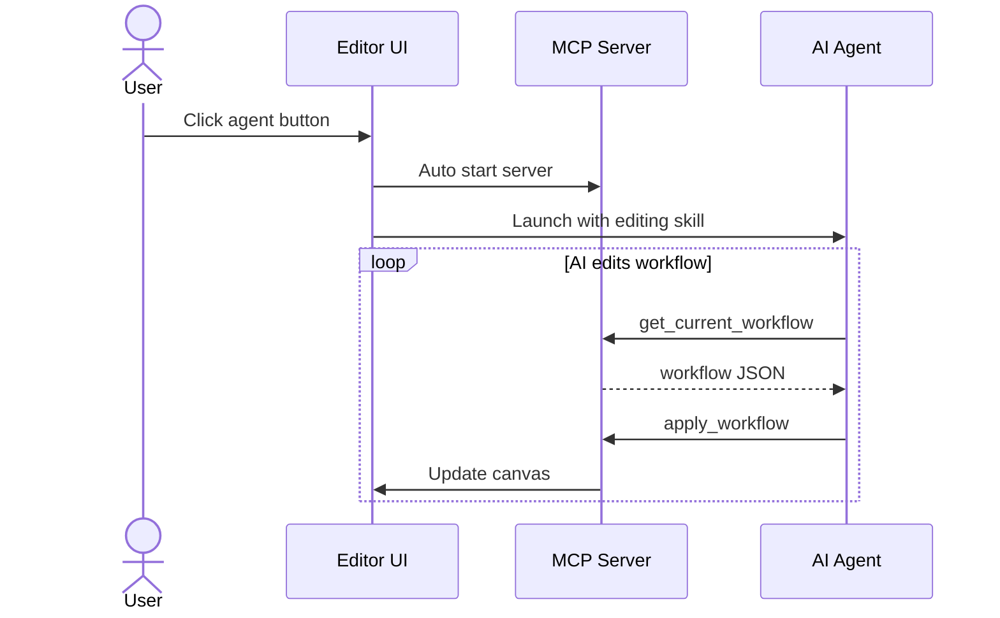

# Edit with AI

CC Workflow Studio ships with an **MCP server** (`cc-workflow-ai-editor`) that exposes the canvas to external AI agents. Click an agent button in the **Edit with AI** panel and the server starts in the background — the agent can then read the current workflow, modify nodes, and apply changes back to the canvas in a loop.



## MCP tools

| Tool | Purpose |
|------|---------|
| `get_current_workflow` | Get the workflow currently on the canvas. |
| `get_workflow_schema` | Get the workflow schema (TOON-formatted). |
| `apply_workflow` | Replace the canvas with a new workflow JSON after validation. |
| `list_available_agents` | List `.claude/agents/*.md` files (user + project scopes). |
| `update_nodes` | Patch specific nodes by ID without resending the whole workflow. |

### Typical loop

An agent usually does something like:

1. `get_workflow_schema` once, to learn the valid shape
2. `get_current_workflow` to read what's on the canvas and capture the `revision` number
3. Decide what to change
4. `update_nodes` for partial edits, or `apply_workflow` for full replacements
5. Repeat from step 2 for the next iteration

If the user has **review mode** enabled, `apply_workflow` and `update_nodes` show a diff dialog. Rejections come back as an error with the message `User rejected the changes`.

### `get_current_workflow`

No input. Returns the workflow JSON, its `revision` number (used for conflict detection), and an `isStale` flag that is `true` when the editor is closed and the workflow came from cache.

```json
{
  "success": true,
  "isStale": false,
  "revision": 42,
  "workflow": { "schemaVersion": "1.0.0", "name": "…", "nodes": [...], "edges": [...] }
}
```

### `get_workflow_schema`

No input. Returns the schema as TOON-formatted text (compact, token-efficient). Use it before generating or editing a workflow so the model knows the valid node types and field constraints.

### `apply_workflow`

**Input:**

```json
{
  "workflow": "{\"schemaVersion\":\"1.0.0\",\"name\":\"…\",\"nodes\":[…],\"edges\":[…]}",
  "description": "Added error handling step after API call",
  "revision": 42
}
```

- `workflow` — the full workflow JSON, as a string
- `description` *(optional)* — shown to the user in the review dialog
- `revision` *(optional)* — if provided and the canvas has moved on, the apply is rejected or a warning is shown

SubAgent nodes without a `commandFilePath` will have `.md` files auto-created under `.claude/agents/`.

### `update_nodes`

Apply partial edits without resending the whole workflow.

**Input:**

```json
{
  "nodes": [
    {
      "id": "node-3",
      "name": "Summarize results",
      "data": { "prompt": "…updated prompt…" }
    },
    {
      "id": "node-5",
      "position": { "x": 600, "y": 240 }
    }
  ],
  "description": "Renamed summary step and moved layout",
  "revision": 42
}
```

Each entry must include `id` and at least one of `name`, `position`, `data`, `type`, `parentId`, or `style`.

- `data` is **shallow-merged**, not replaced. Set a field to `null` to delete it: `{ "commandFilePath": null }`
- `type` changes require a new `data` object (fully replaces the old one)
- Only existing nodes are updated — use `apply_workflow` to add or remove nodes

### `list_available_agents`

**Input:**

```json
{ "includeContent": false }
```

Returns agent definition files from `~/.claude/agents/` and project-level `.claude/agents/`:

```json
{
  "success": true,
  "totalCount": 7,
  "userCount": 3,
  "projectCount": 4,
  "commands": [
    { "name": "code-reviewer", "description": "…", "scope": "project", "commandPath": ".claude/agents/code-reviewer.md" }
  ]
}
```

Set `includeContent` to `true` to include the full prompt body of each file.

## Configuration

| Setting | Default | Purpose |
|---------|---------|---------|
| `cc-wf-studio.mcp.port` | `6282` | Port the embedded MCP server listens on |
| `cc-wf-studio.ai.schemaFormat` | `toon` | Format returned by `get_workflow_schema` |

See also: [Workflow JSON Schema](./workflow-schema) for the shape of the workflow data the tools operate on.
